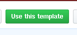

<!-- PROJECT SHIELDS -->
[![Forks][forks-shield]][forks-url]
[![Stargazers][stars-shield]][stars-url]
[![Issues-open][issues-open-shield]][issues-url]
[![Issues-closed][issues-closed-shield]][issues-url]
[![Contributors][contributors-shield]][contributors-url]
[![Framework][badge-framework]][framework-url]
[![contributions welcome][contributions-welcome]][issues-url]

<!-- PROJECT LOGO -->
<br />
<p align="center">
  <a href="https://">
	  
  </a>

  <h1 align="center">
	HTML-LESS-JS-no-webpack-starter
  </h1>

  <p align="center">
    Single page webpage with LESS support and vanillaJS framework
    <br />
	  🖊️
    <a href="https://">Read the article</a>
    🐞
    <a href="https://github.com/Israel-Laguan/HTML-LESS-JS-no-webpack-starter/issues">Report a Bug</a>
    🙋‍♂️
    <a href="https://github.com/Israel-Laguan/HTML-LESS-JS-no-webpack-starter/issues">Request Feature</a>
  </p>
</p>

## Table of Contents

1. [JS no-webpack Template](#js-no-webpack-template)
2. [Features](#features)
3. [Pre Requisites](#pre-requisites)
4. [Creating a new project](#creating-a-new-project)
5. [Author](#author)
6. [Contributing](#contributing)
7. [Show your support](#show-your-support)
8. [License](#license)

# JS no-webpack Template

Welcome to our Javascript template meant to be used for [Microverse](https://www.microverse.org/)'s projects on JS (before webpack)!
Generate your JS project the easy way!


## Features

* Setup a basic VanillaJS app with a single script or few commands
* Makes LESS ready to use with all its benefits
* Lets us use JS modules and ES6+ available for most browsers
* Ready made examples on CSS and Less
* Sets `stickler` on the repo
* Sets `eslint` rules
* Example of Web Components
* Gives you a great README to start with
* Easy to generate projects in GitHub
* Meant to be useful for Microverse students and anyone that wants a JS' Apps (no webpack)

# Pre Requisites

The script requires you to have:

- Some compatible Linux OS (We tested on Debian/Ubuntu derivatives)
- `nodejs` latest LTS version
- `git` and normal development stuff
- Basic terminal and script knowledge
- Some common sense

Now, this is meant to be used as a [GitHub Template](https://help.github.com/en/github/creating-cloning-and-archiving-repositories/creating-a-repository-from-a-template),
so please don't clone this repository (unless you want to collaborate), 
use [this button](https://github.com/Israel-Laguan/HTML-LESS-JS-no-webpack-starter/generate) instead.

<div align="center">
    <a href="https://github.com/Israel-Laguan/HTML-LESS-JS-no-webpack-starter/generate" target="_blank">
        
    </a>
</div>

## Creating a new project

After you used the template in your project, clone your project in you PC and 
open a terminal inside your project, like this: 

```
git clone <your-repo-link>
cd <Your-project>
````

First run the [script](run_me.sh) provided:

```
chmod -x ./run_me.sh
bash ./run_me.sh
```

In VS Code, Ctrl + Shift + X
Search ESLint
Install ESLint
Restart VS Code
<!-- https://travishorn.com/setting-up-eslint-on-vs-code-with-airbnb-javascript-style-guide-6eb78a535ba6 -->
Last but not least the script remove this README and substitute for the renamed [README.TEMPLATE](README.TEMPLATE.md) (meant to be used for _Microverse Projects_), so if you are running each command instead of using the script make the change of READMEs manually.

## Troubleshooting

# License

This project is licensed under the Apache 2 License - see the [LICENSE.md](LICENSE.md) file for details.

# Author

<table style="width:100%">
  <tr>
    <td>
        <div align="center">
            <a href="./docs/img/photo.png" target="_blank" rel="author">
                
            </a>
            <h2>
                <a href="https://israel-laguan.github.io/" target="_blank" rel="author">
                    Israel Laguan
                </a>
            </h2>
        </div>
    </td>
    <td>
        <div align="center">
            <a href="mailto:israellaguan@gmail.com" target="_blank" rel="author">
                
                <h3>
                    Email me to 
                    <a href="mailto:israellaguan@gmail.com">
                        israellaguan@gmail.com
                    </a>
                </h3>
            </a>
            <a href="https://www.linkedin.com/in/israellaguan/" target="_blank" rel="author">
                
                <h3>
                    Connect to my Linkedin
                </h3>
            </a>
            <a href="https://github.com/Israel-Laguan" target="_blank" rel="author">
                
                <h3>
                    Check my GitHub Profile
                </h3>
            </a>
        </div>
    </td>
  </tr>
</table> 

# Contributing

[![contributions welcome][contributions-welcome]][issues-url]

🤝 Contributions, issues and feature requests are welcome!
Feel free to check the [issues page][issues-url].

# Show your support

🤗 Give a ⭐️ if you like this project!

Icons from:

<a href="https://icons8.com/icon/13917/full-image">Icons8</a>

<!-- MARKDOWN LINKS & IMAGES -->
[contributors-shield]: https://img.shields.io/github/contributors/Israel-Laguan/HTML-LESS-JS-no-webpack-starter?style=for-the-badge
[contributors-url]: https://github.com/Israel-Laguan/HTML-LESS-JS-no-webpack-starter/graphs/contributors
[forks-shield]: https://img.shields.io/github/forks/Israel-Laguan/HTML-LESS-JS-no-webpack-starter?style=for-the-badge
[forks-url]: https://github.com/Israel-Laguan/HTML-LESS-JS-no-webpack-starter/network/members
[stars-shield]: https://img.shields.io/github/stars/Israel-Laguan/HTML-LESS-JS-no-webpack-starter?style=for-the-badge
[stars-url]: https://github.com/Israel-Laguan/HTML-LESS-JS-no-webpack-starter/stargazers
[issues-open-shield]: https://img.shields.io/github/issues/Israel-Laguan/HTML-LESS-JS-no-webpack-starter?style=for-the-badge
[issues-url]: https://github.com/Israel-Laguan/HTML-LESS-JS-no-webpack-starter/issues
[issues-closed-shield]: https://img.shields.io/github/issues-closed/Israel-Laguan/HTML-LESS-JS-no-webpack-starter?style=for-the-badge
[badge-framework]: https://img.shields.io/badge/framework-here-9cf?style=for-the-badge
[framework-url]: https://google.com
[contributions-welcome]: https://img.shields.io/badge/contributions-welcome-brightgreen.svg?style=for-the-badge
[badge-license]: https://img.shields.io/:license-mit-blue.svg?style=for-the-badge
